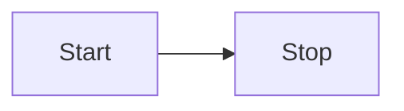

		tab을 두번 누르면 위의 백틱(`)을 사용한 것과 같습니다.
빨간 글씨
파란 글씨
초록 글씨
노란 글씨
보라 글씨

  
이 블로그의 닉네임은?

  poeun. 열린상태로 보여준다.

  
블로그를 더욱 알고 싶다면?

  github.com/ingu627 로 이동한다.

[^1]:  : 참고 문헌은 [^1]을 한다음 :을 붙이면 자동으로 생성이 됩니다. (주석과 참조 번호가 서로 연결됩니다.)

~~취소선~~

텍스트 뒤에 space bar를 두번 치고 enter를 누른 뒤 다음 텍스트를 씁니다.  
다음  
다음  
다음
다음

😁
이것은 ==하이라이트== 입니다.
 
 
이 태그는 H2O를 표현할 수 있습니다.
><q> 일단 실천하라. 그러면 힘을 지니게 될 것이다. </q> -왈도 에머슨-

설명
: 이해시키는 것을 목적으로 하는 진술 방법
&copy;

**Watch out!** Text~
{: .notice}

**Watch out!** Text~
{: .notice--primary}

**Watch out!** Text~
{: .notice--info}

**Watch out!** Text~
{: .notice--warning}

**Watch out!** Text~
{: .notice--success}

**Watch out!** Text~
{: .notice--danger}

<html>
<body>
빨간 글씨
파란 글씨
초록 글씨
노란 글씨
보라 글씨

빨간 글씨  
파란 글씨  
초록 글씨  
노란 글씨  
보라 글씨 

<b>글자는 흰색, 배경은 빨강, 사이즈는 150, 굵기는 b태그로 설정</b>

		탭2번

이 태그는 H2O를 표현할 수 있습니다
이 태그는 22를 표현할수 있습니다.
이것은 ==하이라이트== 입니다.
	
 <pre class="mermaid">
    flowchart TB
    c1-->a2
    subgraph one
    a1-->a2
    end
    subgraph two
    b1-->b2
    end
    subgraph three
    c1-->c2
    c3-->a2
    c4-->a2
    end
</pre>

<h2>Mermaid graph diagram:</h2>
<table><tr>
<td>
<pre>
graph TD 
A[Client] --> B[Load Balancer] 
B --> C[Server1] 
B --> D[Server2]
</pre>
</td>
<td>
<pre class="mermaid">
	graph TD 
	A[Client] --> B[Load Balancer] 
	B --> C[Server1] 
	B --> D[Server2]
 </pre>
</td>
<td><pre>
   graph TD 
	A[Client] -->|tcp_123| B
	B(Load Balancer) 
	B -->|tcp_456| C[Server1] 
	B -->|tcp_456| D[Server2]
</pre></td>
<td>
<pre class="mermaid">
	graph TD 
	A[Client] -->|tcp_123| B
	B(Load Balancer) 
	B -->|tcp_456| C[Server1] 
	B -->|tcp_456| D[Server2]
 </pre>
</td>
</tr></table>

<h2>Basic flowchart</h2>
<table><tr><td>
<pre>
graph LR
    A[Square Rect] -- Link text --> B((Circle))
    A --> C(Round Rect)
    B --> D{Rhombus}
    C --> D
</pre>
</td><td>
<pre class="mermaid">
graph LR
    A[Square Rect] -- Link text --> B((Circle))
    A --> C(Round Rect)
    B --> D{Rhombus}
    C --> D
</pre>
</td></tr></table>

<h2>Basic flowchart 2</h2>
<table><tr><td>
<pre>
graph TB
    A[Square Rect] -- Link text --> B{Rhombus}
    B -->C
    B --> D{Rhombus}
    D --> E
    D --> F
    D --> G
</pre>
</td><td>
<pre class="mermaid">
graph TB
    A[Square Rect] -- Link text --> B{Rhombus}
    B -->C
    B --> D{Rhombus}
    D --> E
    D --> F
    D --> G
</pre>
</td></tr></table>

<h2>Timeline Example</h2>
<table><tr><td>
<pre>timeline
    title History of Social Media Platform
    2002 : LinkedIn
    2004 : Facebook
         : Google
    2005 : Youtube
    2006 : Twitter
</pre>
</td><td>
 <pre class="mermaid">
timeline
    title History of Social Media Platform
    2002 : LinkedIn
    2004 : Facebook
         : Google
    2005 : Youtube
    2006 : Twitter
	</pre>
</td></tr></table>

<h2>Pie chart:</h2>
<table><tr><td>
<pre>	
pie title NETFLIX
	 "Time spent looking for movie" : 90
	 "Time spent watching it" : 10
</pre>
</td><td>
 <pre class="mermaid">
pie title NETFLIX
	 "Time spent looking for movie" : 90
	 "Time spent watching it" : 10
</pre>
</td></tr></table>

<h2>Mindmap Diagram</h2>
<table><tr><td>
<pre>
mindmap
  root((mindmap))
    Origins
      Long history
      ::icon(fa fa-book)
      Popularisation
        British popular psychology author Tony Buzan
    Research
      On effectiveness and features
      On Automatic creation
        Uses
            Creative techniques
            Strategic planning
            Argument mapping
    Tools
      Pen and paper
      Mermaid
</pre>
</td><td>
<pre class="mermaid">
mindmap
  root((mindmap))
    Origins
      Long history
      ::icon(fa fa-book)
      Popularisation
        British popular psychology author Tony Buzan
    Research
      On effectiveness and features
      On Automatic creation
        Uses
            Creative techniques
            Strategic planning
            Argument mapping
    Tools
        Pen and paper
        Mermaid
</pre>
</td></tr></table>

<h2>Requirement Diagram</h2>
<table><tr><td>
<pre>
    requirement test_req {
    id: 1
    text: the test text.
    risk: high
    verifymethod: test
    }

    element test_entity {
    type: simulation
    }

    test_entity - satisfies -> test_req
</pre>
</td><td>
<pre  class="mermaid">
requirementDiagram
    requirement test_req {
    id: 1
    text: the test text.
    risk: high
    verifymethod: test
    }

    element test_entity {
    type: simulation
    }

    test_entity - satisfies -> test_req
</pre>
</td></tr></table>

<h2>Complete flowchart</h2>
<table><tr><td>
<pre>
Left to right(LR) graph orientation :
(options:
TB - top to bottom
TD - top-down/ same as top to bottom
BT - bottom to top
RL - right to left
LR - left to right )

graph LR
    A[Square Rect] -- Link text --> B((Circle))
    A --> C(Round Rect)
    B --> D{Rhombus}
    C["`**Markdown** string`"] --> D
	E -->F([Stadium-shaped node]}
	id1[[This is  subroutine shape]]
	id2[(Database)]
	id3((This is the text in the circle))
	id4 >asymmetric shape]
	id5{decision} 
	id6{{Hexagon}}
	id7[/Parallelogram/] 
	id8(((Double circle)))
	F-.->dottedLink;
	G-.dotted link with text .->H
	H == thick link ==> I
	J -- text --> K -- chaining link --> L
	M --o N
    N --x O
	O x--x P
</pre>
</td><td>
<pre class="mermaid">
graph LR
    A[Square Rect] -- Link text --> B((Circle))
    A --> C(Round Rect)
    B --> D{Rhombus}
    C --> E["`**Markdown** string`"] 
	E -->F([Stadium-shaped node])
	id1[[This is subroutine shape]]
	id2[(Database)]
	id3((This is the text in the circle))
	id4>asymmetric shape]
	id5{decision}
	id6{{Hexagon}}	
	id7[/Parallelogram/]
	id8(((Double circle)))
	F-.->dottedLink;
	G-.dotted link with text .->H
	H == thick link ==> I
	J -- text --> K -- chaining link --> L
	M --o N
    N --x O
	O x--x P
	
</pre>
</td></tr></table>

<h2>real flowchart</h2>
<table><tr><td>
<pre>
flowchart TD
    A[Start] --> B{Is it?}
    B -->|Yes| C[OK]
    C --> D[Rethink]
    D --> B
    B ---->|No| E[End]

</pre>
</td><td>
<pre class="mermaid">
flowchart TD
%% this is a comment : TD means top down orientation of the chart
    A[Start] --> B{Is it?}
    B -->|Yes| C[OK]
    C --> D[Rethink]
    D --> B
    B ---->|No| E[End]

</pre>
</td></tr></table>

<h2>Styling</h2>
<table><tr><td>
<pre>
flowchart LR
    id1(Start)-->id2(Stop)
    style id1 fill:#f9f,stroke:#333,stroke-width:4px
    style id2 fill:#bbf,stroke:#f66,stroke-width:2px,color:#fff,stroke-dasharray: 5 5
</pre>
<pre  class="mermaid">
flowchart LR
    id1(Start)-->id2(Stop)
    style id1 fill:#f9f,stroke:#333,stroke-width:4px
    style id2 fill:#bbf,stroke:#f66,stroke-width:2px,color:#fff,stroke-dasharray: 5 5
</pre>
</td></tr></table>

<h2>Applying CSS classes</h2>
<table><tr><td>
<pre>
<!-- predefine class -->

code:
flowchart LR
    A-->B[AAABBB]
    B-->D
    class A cssClass
</pre>

<pre  class="mermaid">
%%{init: {"flowchart": {"defaultRenderer": "elk"}} }%%
flowchart LR
    A-->B[AAABBB]
    B-->D
    class A mycssClass
</pre>
</td></tr></table>

<h2>Markdown not work</h2>

~~~
flowchart LR
    id1[This is the text in the box]

~~~

~~~ mermaid
flowchart LR
    Start --> Stop

flowchart LR
    id1[This is the text in the box]
~~~

<!-------------------------------------------------------------------------------------->
</body>

<!--

-->

</html>
