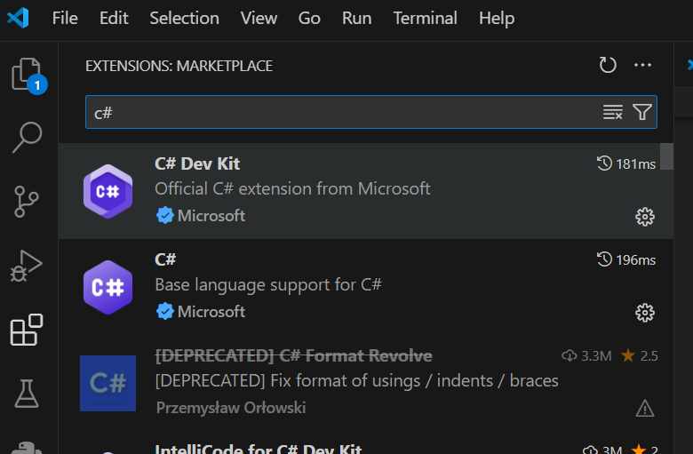
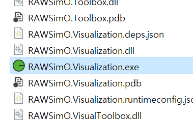
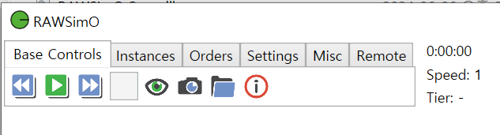
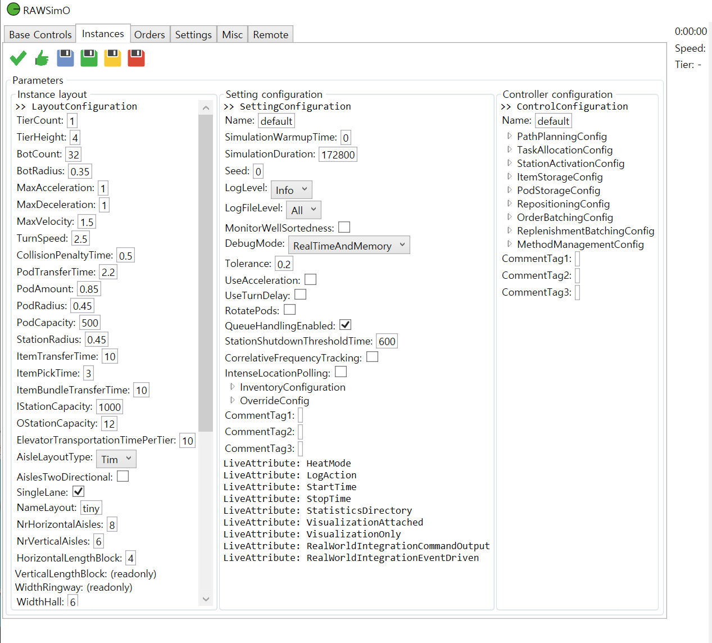
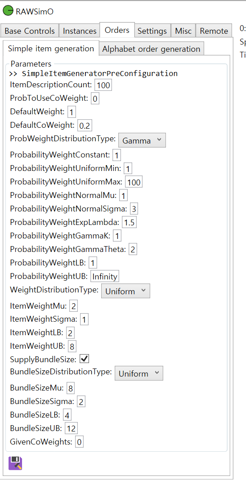
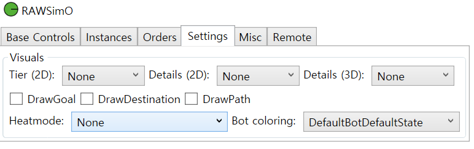
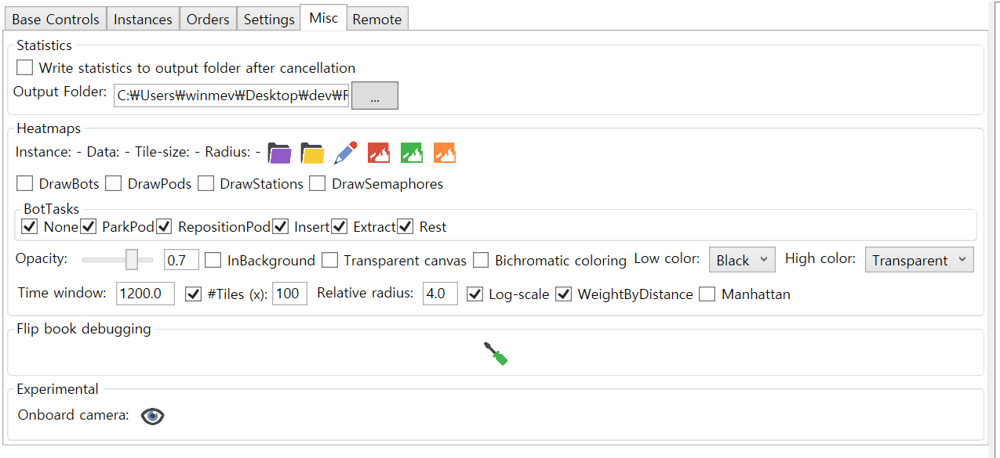

##  1. 환경 설정
(1) VSCODE 설치
https://code.visualstudio.com/download

(2) .NET 8.0 SDK 설치
https://dotnet.microsoft.com/en-us/download/dotnet/8.0

(3) .NET 6.0 SDK 설치
https://dotnet.microsoft.com/ko-kr/download/dotnet/6.0

(4) VSCODE를 실행하고 C# extention 설치



## 2. 빌드 방법
RAWSim-O코드를 다운로드 받고 vscode 내 탐색창에서 
./RAWSim-O-main/RAWSimO.Visualization위치로 이동한다. 폴더로 마우스 오른쪽 버튼을 클릭하고 open in Integrated terminal.

터미널 창에서 dotnet run(필요시 dotnet restore 먼저 실행)

```console
RAWSimO.Visualization> dotnet run
```

* 참고로 실행이 완료되면 bin\Debug\net6.0-windows 폴더에 실행파일(exe)도 생성됨.  


## 3.  실행 화면 구성
(1) Base Controls  

- 재생 버튼: 시뮬레이션 시작
- 눈 모양 버튼: 2D와 3D모드 변환
- 실행하면 사전에 설정된 파라미터 값을 토대로 시뮬레이션 그래픽이 나타난다. 오른쪽에는 대쉬보드가 있어서 운영현황을 파악할 수 있다.

(2) Instances


각종 파라미터를 설정할 수 있다.
- Instance Layout: 레이아웃관련 설정  
  예) station의 위치 지정이나 복도, 엘레베이터 등을 입력.
- Settings configuration: 창고 운영 시나리오 관련 값을 조정할 수 있다.  
  예) 오더 종류, 물품, 재고 구성, 시뮬레이션  기간, 수량 등 
- Controller configuration: 알고리즘이나 전략 선택  
  예) 경로계획, Pod 이동 목적지 결정 등

(3) Orders
  
주문관련 통계 분포 설정

(4) Settings  
  
시뮬레이션 실행시 이동경로, 색상 등을 설정

(5) Misc
  
출력용 통계 데이터 위치 설정 및 히트맵 속성 설정

 
## 4. 코드 분석

(1) Material: 시뮬레이션 구동을 위한 설정 파일 관리. resource폴더는 CLI(command line interface)를 사용하는 경우 필요. 

(2) AppInputStation: 입고 장소 

(3) AppOutputStation: 출고 장소

(4) AppRobot: 로봇 

(5) AppServer: 서버 

(6) CLI: 화면처리없이 터미널상으로만 처리하고 싶을 때 이용 

(7) CommmFramework: 서버와 통신 

(8) Core: 모든 핵심동작 처리 

(9) DataPreparation: 데이터 전처리

(10) DEA: 분석 처리  Data Envelopment Analysis 

(11) Hardware: 실제 로봇과 연동시 이용 

(12) MDPSolve: 경로계획 

(13) MultiAgentPathFinding: 경로계획 

(14) Playground: 실험용 기능 

(15) Toolbox: 공통함수  

(16) Visualization: 화면단 담당, 버튼 클릭처리, rendering에서 3D 처 

(17) VisualToolbox: 화면처리용 공통함수 


> 참고
> - 논문: https://arxiv.org/abs/1710.04726
> - 코드: https://github.com/merschformann/RAWSim-O
 
