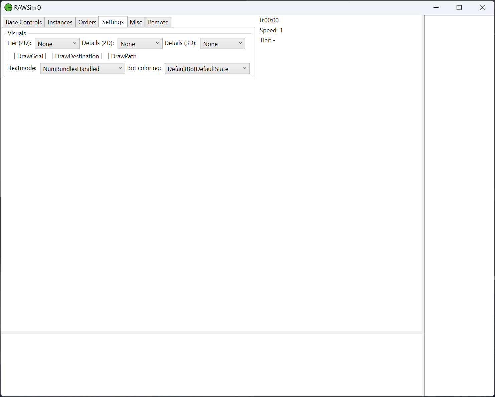
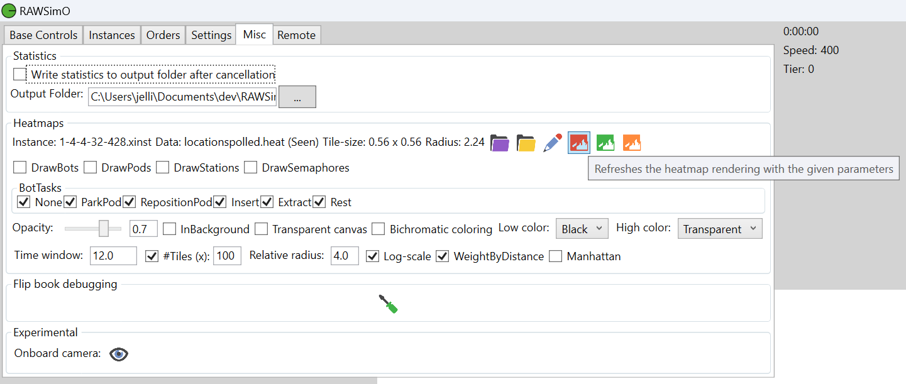

## Index

* [1. 환경 설정](#title1)
* [2. 빌드 방법](#title2)
* [3. 실행 화면 구성](#title3)
* [ (1) Base Controls](#title3-1)
* [ (2) Instances](#title3-2)
* [ (3) Orders](#title3-3)
* [ (4) Settings](#title3-4)
* [ (5) Misc](#title3-5)
* [4. 코드 분석](#title4)
* [참고](#title5)

## 1. heatmode 설정
Settings 탭 > Heatmode 콤보박스에서 원하는 히트맵 모드를 선택

## 2. Instance 생성
Insatances 탭에서 실험할 환경을 설정하고 체크 버튼을 눌러서 인스턴스를 생성한다.

여기서는 .xinst 파일만 저장한다.

## 3. 시뮬레이션 실행
Base Controls 탭에서 시작 버튼 클릭하고 시뮬레이션이 끝날 때까지 기다린다.

## 4. 히트맵 만들기  
MISC 탭에서 Heatmaps 블락에 있는 첫번째 폴더 아이콘을 클릭하고,
시작 단계에서 저장한 xinst파일을 불러온다.

다음으로 두번째 폴더 아이콘을 클릭하여 .heat 파일을 하나 불러온다.
(여기서는 locationspolled.heat을 선택함.)

추가로 옵션을 선택할 수 있지만 locationspolled은 seen만 선택할 수 있다.

네번째 아이콘으로 바로 클릭해주면 히트맵이 나타난다.

여섯번째 아이콘을 누르면 시간창에따라 히트맵이 변하는 것을 볼 수 있다.

